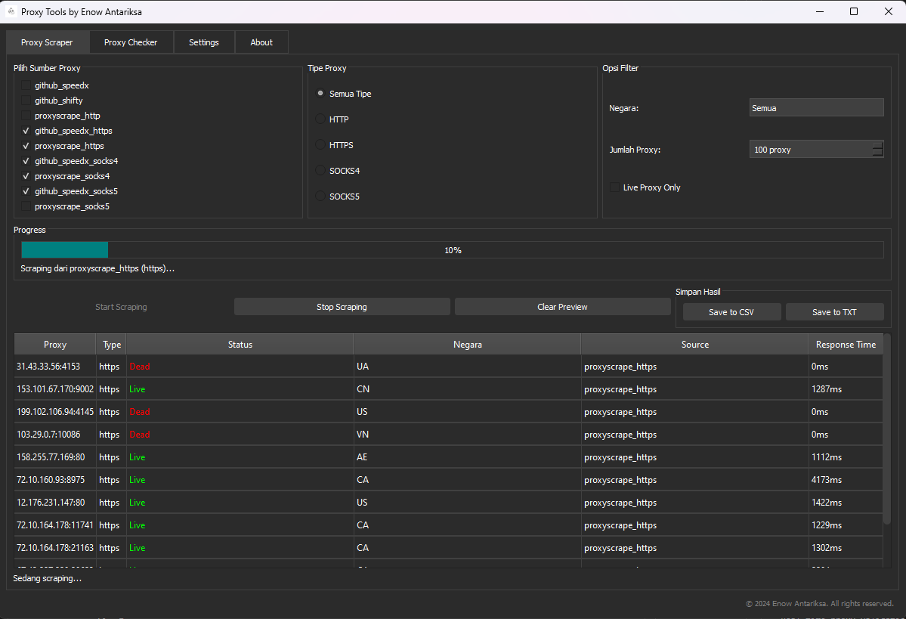
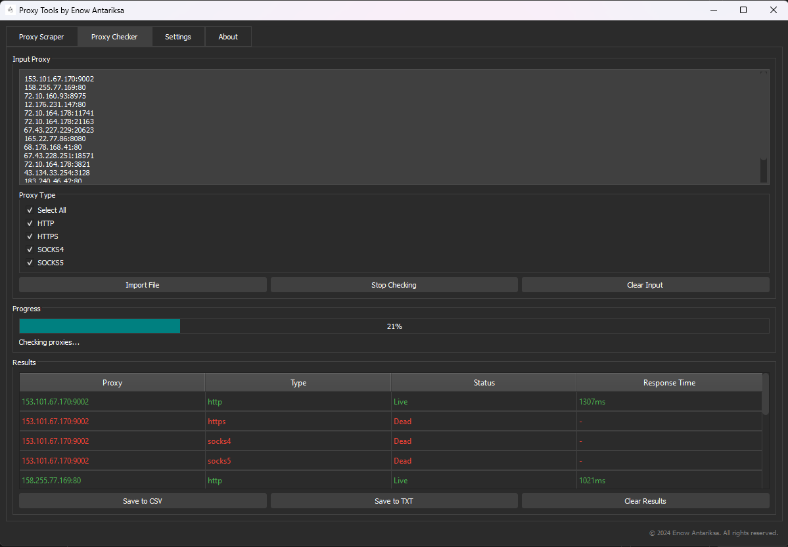

# 🌐 Proxy Tools

  
  
  
  
  
  
  *A powerful and user-friendly proxy management tool with scraping and checking capabilities.*

## ✨ Features

### 🔍 Proxy Scraper
- Multi-source proxy scraping
- Support for HTTP, HTTPS, SOCKS4, and SOCKS5 proxies
- Customizable filters (country, anonymity level)
- Real-time proxy validation
- Export to CSV/TXT formats

### 🔒 Proxy Checker
- Bulk proxy checking
- Multiple protocols support
- Response time measurement
- Detailed status reporting
- Export working proxies

### ⚙️ Additional Features
- Dark/Light theme support
- Multi-language interface
  - English
  - Indonesian
  - Chinese
  - Japanese
- User-friendly GUI
- Save/Load functionality

## 🚀 Quick Start

### Using the Application

1. **Proxy Scraping**
   - Select proxy sources
   - Choose proxy types
   - Set filters (optional)
   - Click "Start Scraping"
   - Export results

   

   
View Screenshot

   
   

2. **Proxy Checking**
   - Input proxies (paste or import)
   - Select proxy types to check
   - Click "Check Proxy"
   - View results and export working proxies

   

   
View Screenshot

   
   

3. **Settings Customization**
   - Change language
   - Switch theme
   - Adjust other preferences

## 📥 Download

Get the latest version:

## 🎯 Use Cases

- Web scraping projects
- Network testing
- Privacy protection
- Bot development
- Research purposes

## 🌟 Why Choose Proxy Tools made By Enow?

- **User-Friendly**: Clean and intuitive interface
- **Efficient**: Fast scraping and checking algorithms
- **Reliable**: Real-time validation of proxies
- **Flexible**: Multiple export options and customization
- **Modern**: Dark mode and multi-language support

## 🤝 Support the Project

If you find this tool useful, consider:
- ⭐ Starring the repository
- 🐛 Reporting issues
- 💡 Suggesting features
- 🤝 Contributing to the code

## 💖 Support Development

  

## 📝 License

This project is licensed under the MIT License - see the [LICENSE](LICENSE) file for details.

---

  Made with ❤️ by <a href="https://github.com/enowdev">Enow Antariksa</a>

